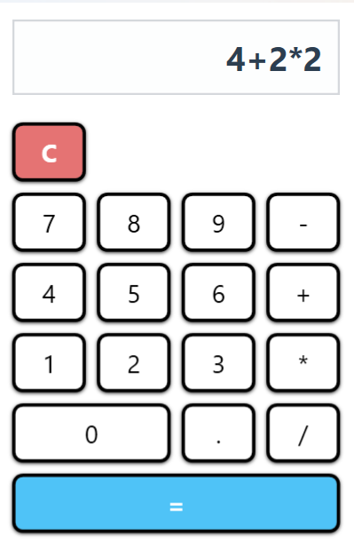
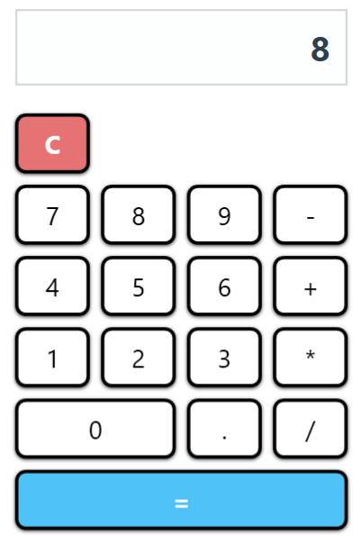
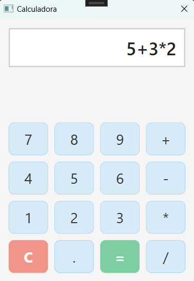
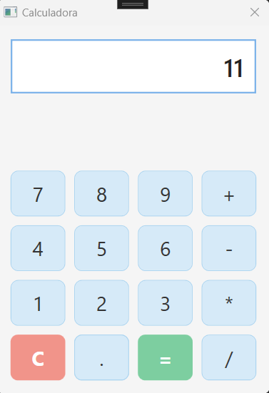

<i class="fa-solid fa-calculator"></i> Calculadora WPF
Una calculadora básica desarrollada con Windows Presentation Foundation (WPF).

<i class="fas fa-bookmark"></i> Tabla de contenidos
Calculadora WPF

Tabla de contenidos

Requisitos

Guía de instalación

Características

Prioridad de operadores

Operaciones básicas

Funcionalidades adicionales

Uso

Ejemplos

Operación de suma

Operación encadenada

Operación con error

Contexto académico

Licencia

Conclusiones y reflexiones sobre el proyecto

<i class="fa-solid fa-plug"></i> Requisitos
<i class="fab fa-windows"></i> Windows 10/11

<i class="fas fa-code"></i> .NET 8.0 Runtime

<i class="fas fa-laptop-code"></i> Visual Studio 2022 (para el desarrollo)

<i class="fa-solid fa-list-check"></i> Características
<i class="fa-solid fa-scale-balanced"></i> Prioridad de operadores
Evalúa * y / antes que + y -
Ejemplo: 5 + 3 * 2 = 11

<i class="fa-solid fa-plus"></i> Operaciones básicas
<i class="fas fa-plus"></i> Suma

<i class="fas fa-minus"></i> Resta

<i class="fas fa-times"></i> Multiplicación

<i class="fas fa-divide"></i> División

<i class="fas fa-star"></i> Funcionalidades adicionales
<i class="fas fa-undo"></i> Borrar (C)

<i class="fas fa-exclamation-triangle"></i> Gestión de errores

<i class="fas fa-link"></i> Operaciones encadenadas

<i class="fas fa-book-open"></i> Uso
Operaciones básicas:
Haz clic en los botones numéricos (0–9), selecciona el operador (+, -, *, /) y pulsa = para ver el resultado.

Reinicio del cálculo:
Pulsa C para borrar la pantalla.

Operaciones encadenadas:
Ejemplo: 5 + 3 * 2 se evalúa correctamente siguiendo la prioridad.

Gestión de errores:
Las entradas incorrectas muestran Error en la pantalla.

<i class="fas fa-images"></i> Ejemplos
Operación de suma
Ejemplo: 5 + 3 = 8

   

Operación encadenada
Ejemplo: 5 + 3 × 2 = 11

   

Operación con error
Ejemplo: 6 / 6 / → Error

   

<i class="fa-solid fa-graduation-cap"></i> Contexto académico
Este proyecto se desarrolló para poner en práctica:

<i class="fas fa-laptop-code"></i> Maquetación con WPF/XAML

<i class="fas fa-project-diagram"></i> Arquitectura de eventos

<i class="fas fa-palette"></i> Principios de UI/UX

<i class="fas fa-cogs"></i> Lógica funcional de una calculadora

<i class="fas fa-balance-scale"></i> Licencia
Licencia MIT

Autor: Duván Vargas

Este proyecto ha permitido desarrollar una calculadora funcional y visualmente cuidada utilizando la tecnología WPF (Windows Presentation Foundation), reforzando conocimientos clave en el diseño de interfaces gráficas modernas y usables. Durante su creación se aplicaron principios de diseño limpio, disposición lógica de controles y una estética personalizable que mejora la experiencia de usuario.

Se trabajó especialmente en:

La organización visual de los botones, buscando una distribución intuitiva y profesional.

El uso de estilos personalizados para mejorar la accesibilidad y dar un aspecto moderno (bordes marcados, sombras y colores coherentes).

La implementación de la lógica básica de una calculadora: operaciones aritméticas, control de errores, uso de operadores encadenados y manejo correcto del punto decimal.

Además, se adaptó el código para permitir una fácil extensión futura, como la posible inclusión de operaciones más avanzadas (porcentajes, raíces cuadradas, historial, etc.).

En resumen, la calculadora no solo cumple su propósito funcional, sino que también demuestra el dominio de conceptos fundamentales de desarrollo de interfaces en C# con WPF, sirviendo como una base sólida para futuros proyectos de software con interfaz gráfica.

<link rel="stylesheet" href="https://cdnjs.cloudflare.com/ajax/libs/font-awesome/6.4.0/css/all.min.css">