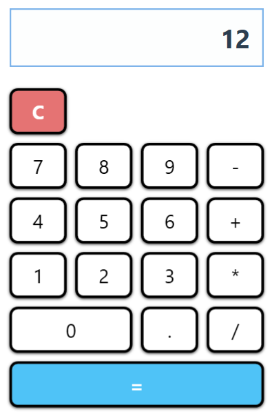
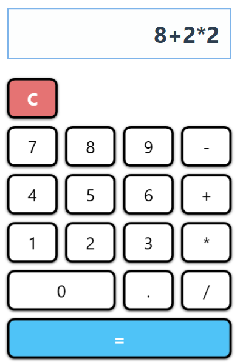
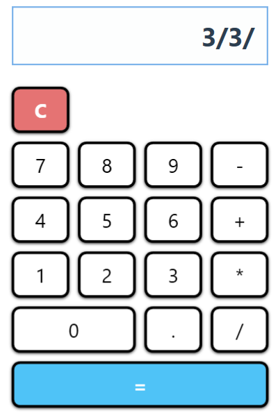
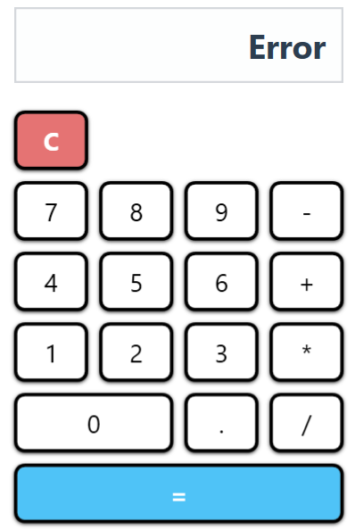

# 🧮 Calculadora WPF

Una calculadora básica desarrollada con **Windows Presentation Foundation (WPF)** como proyecto final del módulo **M0488 - Desarrollo de Interfaces**.

---

## 📑 Índice

- [🧰 Requisitos del Sistema](#-requisitos-del-sistema)
- [✨ Funcionalidades Principales](#-funcionalidades-principales)
- [🚀 Guía de Instalación](#-guía-de-instalación)
- [🧭 Guía de Uso Paso a Paso](#-guía-de-uso-paso-a-paso)
- [🖼️ Ejemplos y Capturas](#-ejemplos-y-capturas)
- [🎓 Contexto Académico](#-contexto-académico)
- [📜 Licencia y Autoría](#-licencia-y-autoría)
- [🧠 Conclusiones](#-conclusiones)

---

## 🧰 Requisitos del Sistema

- 💻 Windows 10/11  
- ⚙️ .NET 8.0 Runtime  
- 🧩 Visual Studio 2022  

---

## ✨ Funcionalidades Principales

- ✅ Operaciones básicas: suma, resta, multiplicación y división  
- 🔄 Evaluación con prioridad de operadores (`*` y `/` antes de `+` y `-`)  
- 🔗 Operaciones encadenadas  
- 🧼 Borrado de entrada (`C`)  
- ❌ Gestión de errores con mensajes claros  
- 🎨 Diseño accesible, intuitivo y adaptable a futuras mejoras  

---

## 🚀 Guía de Instalación

 **Clona este repositorio**:

   ```bash
   git clone https://github.com/Dvnsp/CALCULADORA.git
Abre el proyecto en Visual Studio 2022:
Archivo ➔ Abrir ➔ Proyecto/Solución ➔ PAC4-Calculadora.sln

Compila la solución:
Compilar ➔ Compilar solución (Ctrl + Shift + B)

Ejecuta la aplicación:
Pulsa F5 o el botón verde de inicio.

🧭 Guía de Uso Paso a Paso
Haz clic en los números (0–9) para escribir tu operación.

Selecciona un operador: +, -, * o /.

Pulsa = para ver el resultado.

Pulsa C para limpiar la pantalla y comenzar una nueva operación.

✔️ El sistema respeta la prioridad de operadores:
Ejemplo: 4 + 2 * 2 se evalúa como 8.

✔️ Manejo de errores:
Si introduces una operación inválida (como 8 / 8 /), aparecerá el mensaje Error.

🖼️ Ejemplos y Capturas
📌 Las imágenes se encuentran en la carpeta screenshots/.

✅ Ejemplo de suma
11 + 9 = 20
  
  

🔄 Ejemplo de operación encadenada
8 + 2 * 2 = 12



❌ Ejemplo con error
3 / 3 / → Error



🎓 Contexto Académico
Este proyecto ha sido desarrollado como práctica de evaluación en el módulo M0488 - Desarrollo de Interfaces.
Se han trabajado las siguientes competencias:

🎨 Diseño de interfaces gráficas usando XAML

🔄 Arquitectura basada en eventos

🧠 Lógica funcional de una calculadora

♿ Accesibilidad y usabilidad

📜 Licencia y Autoría
Licencia: MIT
Autor: Duván Vargas

🧠 Conclusiones
Esta calculadora es un ejemplo funcional de aplicación WPF con enfoque en buenas prácticas de desarrollo de interfaces. Se ha logrado:

✅ Separar la lógica de presentación (patrón MVVM simplificado)

✅ Diseñar una interfaz limpia, moderna y comprensible

✅ Implementar una lógica sólida, fácilmente ampliable

🔧 Este proyecto puede servir como base para futuras aplicaciones más avanzadas, como calculadoras científicas, educativas o con historial de operaciones.